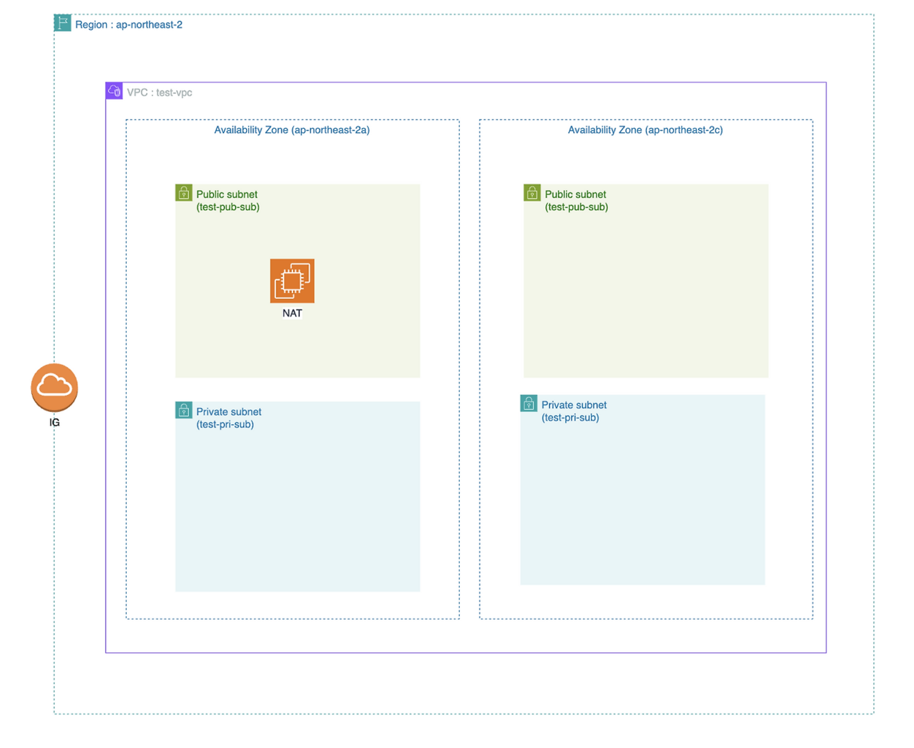

### 디렉토리 구조
```
terraform/
├── modules/
│   └── vpc/
│       ├── main.tf
│       ├── variables.tf
│       └── outputs.tf
├── env/
│   └── dev/
│       ├── main.tf
│       ├── variables.tf
│       └── terraform.tfvars
└── provider.tf
```

### 아키텍처 구조


